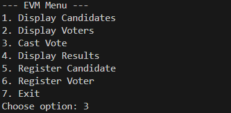

<h1>🗳️ Electronic Voting Machine (EVM) – Java OOP Project</h1>

<strong>Developed by:</strong> Yousuf 
<strong>Language:</strong> Java (console-based application) 
<strong>Implementation:</strong> Object-Oriented Programming using ArrayList

<h2>📌 Project Overview</h2>

This project simulates a simple <strong>Electronic Voting Machine (EVM)</strong> in Java. 
It uses important OOP concepts such as <strong>Encapsulation, Inheritance, Abstraction, Polymorphism</strong> and makes use of Java Collections (<strong>ArrayList</strong>) to dynamically store Candidates and Voters.  
The goal is to allow <strong>pre-registered voters</strong> to cast votes to the <strong>registered candidates</strong>, store the votes in ArrayLists, and display the election results at the end.

<h2>✅ Concepts Used</h2>
<table>
  <tr><th>Concept</th><th>Explanation</th></tr>
  <tr><td>Encapsulation</td><td>Private fields (voteCount, hasVoted) with public methods to access/mutate</td></tr>
  <tr><td>Inheritance</td><td>Candidate and Voter inherit from base class Person</td></tr>
  <tr><td>Polymorphism</td><td>displayDetails() method overridden in Candidate and Voter</td></tr>
  <tr><td>Abstraction</td><td>VotingMachine (abstract) implemented by EVMSystem</td></tr>
  <tr><td>Packages</td><td>common, candidate, voter, evm</td></tr>
  <tr><td>ArrayList</td><td>Dynamic storage of all Candidate and Voter objects</td></tr>
</table>

<h2>🧱 Folder Structure</h2>
<pre>
EVM_Project/
├── common/
│   └── Person.java
├── candidate/
│   ├── Candidate.java
│   └── CandidateManager.java
├── voter/
│   ├── Voter.java
│   └── VoterManager.java
├── evm/
│   ├── VotingMachine.java
│   └── EVMSystem.java
└── Main.java
</pre>

<h2>⚙️ Features</h2>
<table>
  <tr><th>Feature</th><th>Description</th></tr>
  <tr><td>Candidate Registration</td><td>Add new candidates (name, ID, party)</td></tr>
  <tr><td>Voter Registration</td><td>Add new voters (name, ID)</td></tr>
  <tr><td>Voting</td><td>Voters cast vote using their ID and desired candidate ID</td></tr>
  <tr><td>Validation</td><td>Only one vote per voter is allowed</td></tr>
  <tr><td>Results Display</td><td>Shows vote counts and declares winner(s)</td></tr>
  <tr><td>Dynamic Storage</td><td>Stores data in ArrayList, allowing unlimited growth at runtime</td></tr>
</table>

<h2>🧭 Program Flow</h2>

<code>

</code>

<h2>🧑‍💻 How to Run</h2>

<strong>Step 1 – Compile</strong>  
<pre>javac -d . common/Person.java candidate/*.java voter/*.java evm/*.java Main.java</pre>

<strong>Step 2 – Run</strong>  
<pre>java Main</pre>

<h2>🧭 REGISTER VOTER </h2>

<code>
  
</code>

<h2>🧭 CAST VOTE</h2>

<code>

</code>

<h2>✅ Example Output (Results Section)</h2>
<pre>
---- Election Results ----
Ali Khan (Party A) - Votes: 3
Sara Ahmed (Party B) - Votes: 1

Winner: Ali Khan (Party A) with 3 votes.
</pre>

<h2>📌 Notes</h2>
<ul>
<li>This project uses ArrayList instead of normal arrays to store objects dynamically.</li>
<li>It demonstrates how OOP + Java Collections can be used together in a real-world mini-project.</li>
<li>Possible future improvements:
  <ul>
    <li>Admin login</li>
    <li>File/database storage</li>
    <li>GUI using Swing or JavaFX</li>
  </ul>
</li>
</ul>

